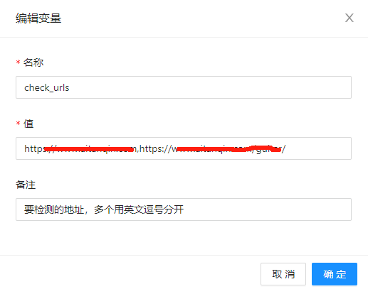
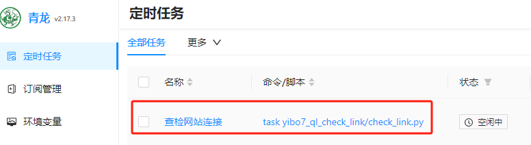
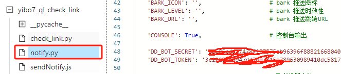

# 死链检查
青龙面板脚本，定时检查网站是否有死链

# 订阅
本脚本使用青龙面板订阅使用
### 1、创建环境变量

    变量名称check_urls，应该的是要检查的网址，多个网址用英文句号分开。

### 2、添加订阅
>ql repo https://github.com/yibo7/ql_check_link.git "check_link" 

### 3、在定时任务中运行测试

# 发送通知

订阅脚本后，在【脚本管理】中可以找到notify.py文件，这里可以配置所有三方通知的密钥，比如我这里配置的了钉钉的机器人：

如果配置了多个机器人，请会同时发送通知。